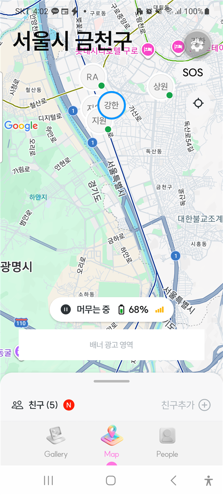
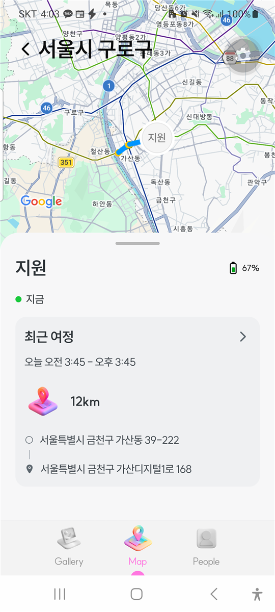
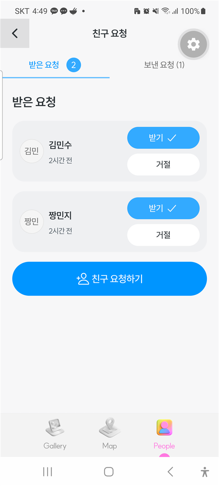
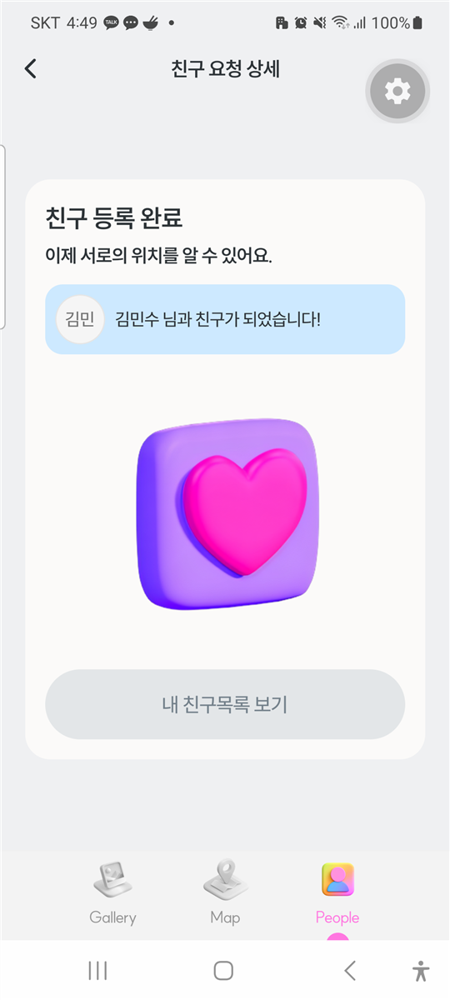
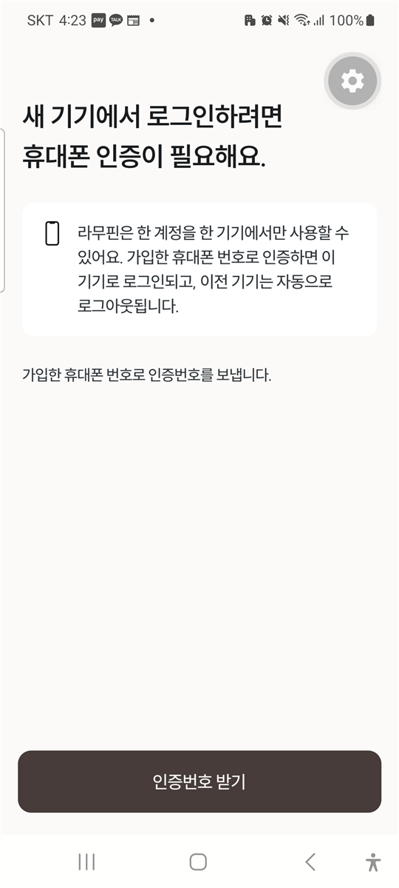
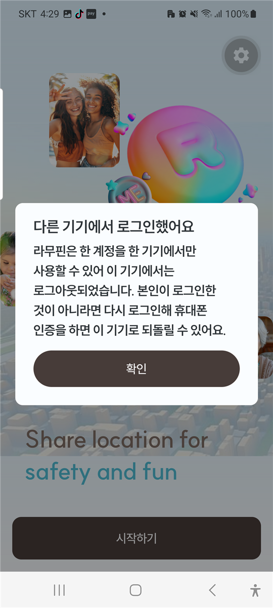

# 라무핀 앱 개발 진행 보고 (1차)

**보고일:** 2026년 9월 28일 (월)  ·  **보고 기간:** 9월 14일 ~ 9월 27일  ·  **계약 기간:** 2026-09-14 ~ 2027-02-14

> 초안: 9월 15일 기준으로 작성했습니다. 보고일 전까지 진행 내용을 갱신합니다.

## 1. 한눈에 보기

| 항목 | 내용 |
|---|---|
| 일정 상태 | 정상 |
| 이번 기간 핵심 | 앱 화면 전체 제작 완료, 서버(데이터 저장소) 기본 구성 완료, 친구·위치 공유·로그인 보안 기능이 실제 서버와 연결됨 |
| 다음 기간 핵심 | 그룹·채팅, 카카오 로그인, 알림(푸시), 여정·안심 장소·SOS 서버 연결 |
| 결정·요청 필요 | 카카오 앱 키, 문자 발송 업체 계약, Apple 개발자 계정 신청, 1차 출시 범위 (5장) |

## 2. 전체 일정과 진행 상황

5개월 안에 안드로이드와 아이폰을 모두 출시하기 위해, 계약 종료일에서 거꾸로 계산한 일정입니다.

| 단계 | 기간 | 목표 | 상태 |
|---|---|---|---|
| 앱 화면 제작 | 9월 | 기획서(피그마)의 모든 화면 | 완료 |
| 서버 기본 구성 | 9월 | 회원·친구·위치 데이터 저장, 로그인 보안 | 진행 |
| 안드로이드 핵심 기능 연결 | 9월 ~ 10월 초 | 친구, 위치 공유, 채팅, 로그인, 알림 | 진행 |
| 백그라운드 위치·비상 상황·결제·광고 | 10월 | 앱을 꺼도 위치 전송, SOS·과속 등 알림, 구독 결제 | 예정 |
| 서버를 실제 인터넷 서버(AWS)에 설치 | 10월 | 외부에서 접속 가능한 서버 | 예정 |
| **안드로이드 기능 완성** | **11월 27일** | 디자인 확정본 반영, 테스트 | 예정 |
| **안드로이드 출시** | **12월 11일** | Google Play 등록 | 예정 |
| 아이폰 작업 | 12월 14일 ~ 1월 15일 | 아이폰 전용 기능(애플 로그인 등) | 예정 |
| **아이폰 출시** | **1월 29일** | App Store 심사 통과 | 예정 |
| 인수인계 | 2월 1일 ~ 2월 14일 | 운영 문서, 소스·계정 이전 (설 연휴 포함) | 예정 |

## 3. 이번 기간에 한 일

### 3-1. 앱 화면 (기획서 기준 전체)

- 지도 메인, 친구 목록·친구 추가(ID·QR코드·연락처·근처), 친구 요청, 친구별 위치 공개 설정
- 그룹 만들기·설정, 채팅방, 갤러리(사진 보기·올리기)
- 친구의 하루 이동 기록(여정)과 이동 경로, SOS(긴급 신고) 화면, 긴급 알림 팝업 6종
- 설정 전체(프로필, 숨기기 모드, 안심 장소, 예약 메시지, 알림 설정, 계정·탈퇴), 구독 요금제 화면
- 가입 과정(소셜 로그인, 프로필 입력, 휴대폰 인증, 약관, 권한 안내, 1인 가구 선택)
- 개발용 스마트폰에 설치해서 실제로 조작하며 확인하고 있습니다.

 

### 3-2. 서버와 연결된 기능 (실제 데이터로 동작)

- **내 위치 전송:** 지도를 보는 동안 내 위치와 배터리 잔량을 서버에 저장합니다. 인터넷이 끊기면 폰에 모아 두었다가 다시 보냅니다.
- **친구 위치 보기:** 친구가 나에게 허락한 수준(정확 / 대략 / 비공개)에 맞춰서만 위치가 보입니다.
- **친구 요청:** ID나 QR코드로 친구 찾기, 요청 보내기·수락·거절·취소. 친구별 위치 공개 수준을 저장합니다.
- **등급별 기능 제한값:** 요금제마다 다른 제한(위치 전송 주기, SOS 인원 등)을 서버에서 받아옵니다. 앱을 고치지 않고 관리자가 바꿀 수 있는 구조입니다.

 

### 3-3. 한 계정 한 기기 로그인 (대표님 요청 사항)

- 같은 계정으로 다른 폰에서 로그인하면 **가입한 휴대폰 번호로 문자 인증**을 다시 받아야 합니다.
- 새 폰에서 인증하면 **이전 폰은 자동으로 로그아웃**되고 "다른 기기에서 로그인했어요" 안내가 뜹니다.
- 폰을 껐다 켜도 로그인은 유지됩니다.
- 문자 발송은 업체 계약 전이라 지금은 시험용 번호로 동작합니다.

 

### 3-4. 서버 구성

- 처음에는 **서버 1대에 데이터베이스까지 함께 설치**하는 구성으로 시작합니다. 비용을 줄이기 위해서입니다.
- 위치 기록은 데이터가 가장 많이 쌓이므로, 나중에 **별도 서버로 옮길 수 있게** 처음부터 나눠서 만들었습니다.
- 위치 기록은 월별로 나눠 저장하고, 오래된 기록(기본 6개월)은 자동 정리할 수 있게 했습니다.
- 지금은 개발 PC에서 동작하며, 10월에 AWS 서버로 옮깁니다.

## 4. 다음 기간 계획 (9월 28일 ~ 10월 11일)

1. 그룹과 채팅을 실시간으로 주고받기
2. 카카오 로그인과 실제 회원가입 저장 (카카오 앱 키를 받는 대로)
3. 알림(푸시) 기능: 친구 요청, SOS 등을 앱이 꺼져 있어도 받기
4. 여정·안심 장소·SOS를 서버와 연결
5. 앱을 꺼도 위치를 보내는 기능 시험 시작 (가장 까다로운 부분이라 일찍 시작)

## 5. 요청 드릴 사항

| 요청 | 담당 | 필요한 시점 | 이유 |
|---|---|---|---|
| 카카오 네이티브 앱 키, 앱 ID 전달 및 콘솔 설정 | 대표님 | 9월 말 | 카카오 로그인 개발 |
| 문자 발송 업체 계약 | 대표님 | 9월 말 | 휴대폰 인증, 새 기기 인증, 긴급 문자 |
| **Apple 개발자 계정(회사 명의) 신청** | 대표님 | **10월 초** | 발급에 1~3주 걸림. 늦으면 아이폰 일정이 밀림 |
| Google Play 개발자 계정·결제 설정 | 대표님 | 10월 중 | 구독 결제 개발, 출시 |
| 위치기반서비스사업자 신고 | 회사 | 지금 시작 | 출시 전 필수, 처리 기간이 김 |
| 1차 출시 범위 확정 | 대표님·기획 | 10월 초 | 부가 기능(네이버 지도, 공공데이터, 날씨·교통 등)은 출시 후 추가 제안 |
| 기획 확인: 요금제 대응표, 노인 기준 나이(75/70세), 친구 추가 시 기본 공개 여부 | 기획 | 10월 초 | 기획서와 WBS 내용이 서로 다름 |
| 디자인 추가 요청 (피그마에 없는 화면 13건) | 디자이너 | 10월 중 | 채팅방 목록, 알림 보관함 등 |

## 6. 위험 요소와 대응

| 위험 | 영향 | 대응 |
|---|---|---|
| Play 스토어의 "백그라운드 위치" 권한 심사가 몇 주 걸리고 반려될 수 있음 | 안드로이드 출시 지연 | 10월 말까지 시연 영상과 함께 먼저 제출 |
| 계약·계정 발급 대기 (카카오, 문자 업체, Apple, Google Play) | 해당 기능 개발·테스트 지연 | 5장 요청 사항에 날짜를 정해 진행 |
| 디자인 확정(10월 30일) 후 화면 수정 | 11월 작업량 증가 | 색·글꼴을 한 곳에서 바꿀 수 있게 만들어 둠 |
| 설 연휴가 계약 종료 직전(2월 초) | 마무리 기간 부족 | 아이폰 출시를 1월 29일로 앞당겨 계획 |

## 7. 소스 공유

| 항목 | 내용 |
|---|---|
| 저장소 | https://github.com/dkramuvia/ramuvia (비공개) |
| 이번 보고 시점 표시(태그) | report-2026-09-28 |
| 구성 | ramupin (앱), ramupin-server (서버), reports (보고서) |
| 제외 항목 | 비밀번호·API 키 등 보안 정보, 기획 원본 문서 |
